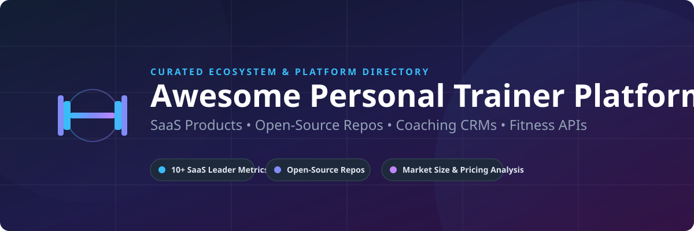

# 🏋️ Awesome Personal Trainer Platform Ecosystem 🏋️‍♀️

  

  
  
  
  
  
  

## 📌 Comprehensive Guide to Online Fitness Coaching Software & Personal Trainer CRMs

**Curated List of Top SaaS Platforms & Open-Source GitHub Projects**

*Focused on Online Coaching 🏋️, Workout Programming 📋, Client Management 👥, Nutrition Tracking 🥗, Workout Tracking ⏱️ & Fitness Business Growth 📈*

**Last updated: September 2026**

---

### 💡 Overview & Market Landscape

This repository tracks notable **SaaS platforms** and **open-source projects** for **Personal Trainer / Online Coaching** software. These systems assist personal trainers, strength & conditioning coaches, and fitness entrepreneurs to deliver workout programs, track client progress, manage nutrition, communicate with clients, and scale their coaching business effectively.

#### 📊 Market Size & Sector Structure Analysis
> **Market Size & Fragmentation Insight**: The global personal training and online coaching software market is estimated at **$4.8 Billion (2026)** and is projected to expand at a CAGR of ~14.2% through 2030. The sector is **moderately fragmented**: while commercial market leaders like Trainerize (ABC Fitness) and Everfit capture major mid-market and enterprise share, hundreds of niche boutique software solutions, specialized habit trackers, and open-source CRMs thrive due to diverse coaching methodologies and custom branding requirements.

---

## 📑 Table of Contents

- [🏢 SaaS/Hosted Platforms](#-saashosted-platforms)
- [🔓 Open-Source GitHub Projects](#-open-source-github-projects)
- [🚀 How to Contribute](#-how-to-contribute)
- [⚠️ Disclaimer](#️-disclaimer)
- [📈 Star History](#-star-history)

---

## 🏢 SaaS/Hosted Platforms

The following commercial personal training and coaching platforms are sorted by **Company Scale / Estimated Revenue & Valuation** in descending order:

| SaaS Platform | Description | Starting Price | Free Tier / Trial Limit | Estimated Scale (Revenue / Valuation) |
| :--- | :--- | :--- | :--- | :--- |
| **[Trainerize (ABC Trainerize)](https://www.trainerize.com/)** | Established personal training and coaching platform with workout delivery, client management, and studio/gym features. Part of ABC Fitness. | $10/month (1 client included; $5/month per extra client) | Free forever plan: 1 client limit; Paid plans have a 30-day free trial | **~$150M+ Revenue** (ABC Fitness parent valuation $1B+) |
| **[Exercise.com](https://www.exercise.com/)** | Enterprise-grade customizable fitness business platform supporting coaching, gyms, and larger training organizations. | $125/month (Enterprise/Custom custom quote basis; demo required) | Demo access upon request; 7-day demo trial with sales team | **~$25M - $50M Revenue** (Estimated Valuation $100M+) |
| **[My PT Hub](https://www.mypthub.net/)** | All-in-one personal trainer platform offering programming, client management, and business tools at accessible pricing. | $49/month (Standard plan, billed monthly, up to 50 active clients) | 30-day free trial (No credit card required) | **~$15M - $25M Revenue** (Estimated Valuation $60M+) |
| **[TrueCoach](https://truecoach.co/)** | Simple, focused coaching platform popular for 1:1 personal training with straightforward programming and client communication. | $29.98/month (Starter plan, billed monthly, up to 5 clients) | 14-day free trial (Full feature access, no credit card required) | **~$10M - $20M Revenue** (Acquired by Xplor Technologies) |
| **[Everfit](https://everfit.io/)** | Modern online coaching platform known for clean UI, automation, workout builder, and client engagement tools. | $19/month (Starter plan, billed monthly, up to 5 clients) | Free forever plan: Up to 5 clients limit; Paid plans have a 30-day free trial | **~$8M - $15M Revenue** (Estimated Valuation $40M+) |
| **[TrainHeroic](https://www.trainheroic.com/)** | Strength-and-conditioning oriented platform used by coaches for team and individual programming. | $9.99/month (Individual coach plan for 1 athlete) | 14-day free trial (No credit card required) | **~$5M - $10M Revenue** (Estimated Valuation $25M+) |
| **[PT Distinction](https://ptdistinction.com/)** | Coaching software emphasizing advanced periodization, programming depth, and professional trainer workflows. | $19.90/month (Novice plan, up to 3 clients) | 1-month (30-day) free trial | **~$3M - $8M Revenue** (Estimated Valuation $20M+) |
| **[FitBudd](https://www.fitbudd.com/)** | White-label focused coaching platform that lets trainers offer branded apps and end-to-end client experiences. | $79/month (Starter plan, billed monthly, up to 20 clients) | 14-day free trial | **~$2M - $5M Revenue** (Venture Backed) |
| **[Coach Catalyst](https://coachcatalyst.com/)** | Habit and coaching platform focused on accountability, check-ins, and behavior change alongside training. | $39/month (Coach plan, billed monthly, up to 12 clients) | 14-day free trial (Full feature access, no credit card required) | **~$1M - $3M Revenue** (Bootstrapped / Profitable) |
| **[TrainerFu](https://www.trainerfu.com/)** | Personal training software for programming, client tracking, and online coaching delivery. | $19/month (Basic plan, up to 10 clients) | Free forever plan: Up to 2 clients limit; Paid plans have a 14-day free trial | **~$500K - $1.5M Revenue** (Independent) |

---

## 🔓 Open-Source GitHub Projects

The following open-source fitness tracking, workout planning, and personal training repositories are sorted by **GitHub Star Count** in descending order:

- **[Snouzy/workout-cool](https://github.com/Snouzy/workout-cool)**   
  Modern open-source fitness coaching platform for creating workout plans, tracking progress, and accessing a comprehensive exercise database.

- **[wger-project/wger](https://github.com/wger-project/wger)**   
  Mature free and open-source workout manager (AGPL) with custom routines, nutrition tracking, weight logging, exercise wiki, and multi-user/gym features. Fully self-hostable.

- **[apoorvdarshan/fud-ai](https://github.com/apoorvdarshan/fud-ai)**   
  Free & open-source AI calorie & workout tracker for mobile devices. Privacy-first, local-first with custom API key support.

- **[parthbuilds-community/FitMart](https://github.com/parthbuilds-community/FitMart)**   
  Full-stack MERN fitness coaching and e-commerce platform with workout tracker, exercise library, AI chatbot, and admin dashboard.

- **[rishavbhandari6789/OpenRehabAgent](https://github.com/rishavbhandari6789/OpenRehabAgent)**   
  A modular multi-agent framework for video-based pain localization and adaptive exercise recommendation for personal trainers & rehab specialists.

- **[joemasilotti/daily-log](https://github.com/joemasilotti/daily-log)**   
  Open-source mobile and web tracker for daily fitness habits, exercise routines, medication, and nutrition logging.

- **[karthick-mallow/BodyProgress](https://github.com/karthick-mallow/BodyProgress)**   
  Simple workout and body progress tracking app with widget support designed for custom trainer workouts.

- **[frontoge/libre-train](https://github.com/frontoge/libre-train)**   
  Open-source CRM for personal trainers covering periodized programs, nutrition, body metrics, assessments, and client management.

---

### 🛠️ Key Open-Source Implementation Strategies

- **Comprehensive Foundation**: Start with **wger** for a complete, self-hosted workout + nutrition + tracking foundation.
- **Modern Web / Mobile Stack**: Evaluate **workout.cool**, **FitMart**, or **libre-train** when a modern CRM or client-facing dashboard is desired.
- **AI & Computer Vision**: Integrate **OpenRehabAgent** or **fud-ai** for automated form checking, pose estimation, and intelligent routine generation.
- **Custom Hybrid Stacks**: Combine open exercise databases with external client messaging (WhatsApp/Discord) and automated Stripe billing for a low-cost, self-hosted coaching setup.

---

## 🚀 How to Contribute

1. 🍴 Fork the repository.
2. 📝 Add or edit entries in `README.md` (following the existing table or list structure).
3. ℹ️ Include: Name, Official link, 1–2 sentence description, Stars_Badge (for open-source), and pricing/scale details (for SaaS).
4. 📬 Submit a Pull Request (PR) with a clear summary of your updates.

⭐ **Star this repo** if you find it helpful for your coaching business or software development!

---

## ⚠️ Disclaimer

- ℹ️ This is a **community-curated resource list** intended for informational and educational purposes only.
- 🔐 Personal training software and coaching platforms process health-related client data and payments. Ensure proper compliance with HIPAA, GDPR, data protection regulations, and privacy consent requirements.
- ⚖️ Open-source or self-hosted platforms require proper server hardening, database backups, and security practices.

---

## 📈 Star History

---

**Made with ❤️ for personal trainers, online fitness coaches, and software developers building the future of fitness technology.**
